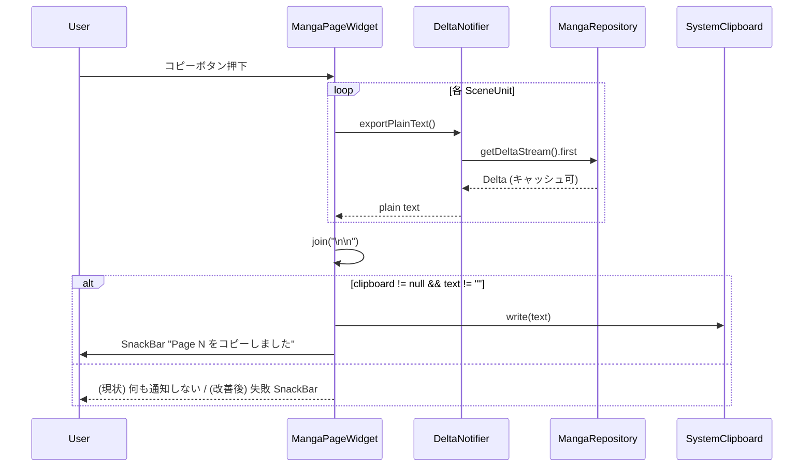
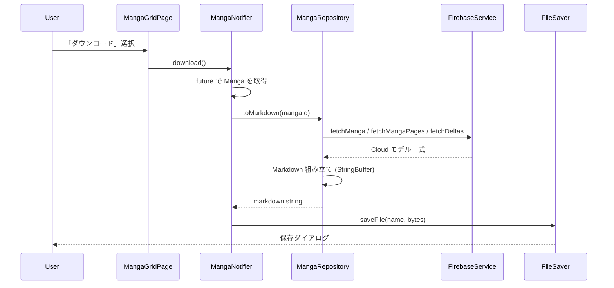

# Design: Manga Export

## 設計サマリ

Export 機能は 2 つの導線を持つ：

1. **ページ単位コピー** — UI (`manga_page_widget`) が `DeltaProvider.exportPlainText` を SceneUnit 順に呼び出し、
   `super_clipboard` の `SystemClipboard` へ書き込む。Repository を経由しない、UI 完結フロー。
2. **作品単位ファイル書き出し** — `MangaNotifier.download` が `MangaRepository.toMarkdown` を呼び、
   `file_saver` パッケージで保存ダイアログを開く。Repository 内部で Firestore から全 Delta を fetch。

両者とも **Delta → 文字列変換** が中核で、ここのロジック重複が現状の主な技術的負債。
本 spec は現状の挙動を保ったまま、変換ロジックを集約する方向で整理する。

## アーキテクチャ上の位置づけ

参照: [docs/design/architecture.md](../../../design/architecture.md)

| レイヤー | 担当 |
|---|---|
| UI (`lib/feature/manga/view/manga_page_widget.dart`) | コピーボタン、SnackBar 表示、`SystemClipboard` 呼び出し |
| UI (`lib/feature/manga/page/manga_grid_page.dart`) | 「ダウンロード」メニューから `MangaNotifier.download` を起動 |
| State (`lib/feature/manga/provider/manga_providers.dart`) | `MangaNotifier.download` / `DeltaNotifier.exportPlainText` / `DeltaNotifier.exportMarkdown` |
| Repository (`local_package/my_manga_editor_data/lib/repository/manga_repository.dart`) | `toMarkdown(MangaId)` で作品全体を文字列化 |
| Common (`local_package/my_manga_editor_common/lib/`) | Delta → プレーンテキスト変換ユーティリティ（FR-005 で新規追加） |
| Service | 変更なし（既存の `fetchManga` / `fetchMangaPages` / `fetchDeltas` を使用） |
| Backend | 変更なし（読み取りのみ） |

## データモデル

参照: [docs/design/data-model.md](../../../design/data-model.md)

本機能で **新規追加するモデルは無い**。既存の以下のみを参照する：

- `Manga` (id, name, ideaMemoDeltaId)
- `MangaPage` (id, memoDeltaId, sceneUnits)
- `SceneUnit` (dialoguesDeltaId, stageDirectionDeltaId)
- `Delta` (flutter_quill の Delta フォーマット)

## 主要フロー

### Flow 1: ページ単位セリフコピー



### Flow 2: 作品単位ファイル書き出し



## 主要 API / インターフェース

```dart
// MangaRepository
Future<String> toMarkdown(MangaId mangaId);

// MangaNotifier (lib/feature/manga/provider/manga_providers.dart)
Future<void> download();

// DeltaNotifier (lib/feature/manga/provider/manga_providers.dart)
Future<String> exportPlainText();
Future<String> exportMarkdown();
```

### 改善実装で追加するもの（T-004 で確定）

```dart
// local_package/my_manga_editor_common/lib/delta_text.dart（新規）
//
// flutter_quill の Delta からプレーンテキストを取り出す。
// - op.data が String のものだけを連結
// - 3 連続以上の改行を 2 連続に圧縮
// - 先頭末尾を trim
String deltaToPlainText(Delta delta);

// 既存呼び出しの差し替え:
//   DeltaNotifier.exportPlainText   → 内部で deltaToPlainText を呼ぶ
//   MangaRepository.toMarkdown      → 旧ループ展開を deltaToPlainText に置換
```

`my_manga_editor_common` に置く理由は UI 層・データ層の両方から呼ぶため。
片側に寄せると依存方向の制約に反する。

## 出力フォーマット（Markdown）

```markdown
# <作品名>

## アイデアメモ                  ← 本文が空なら出力しない

<アイデアメモ本文>

## ページ 1
### メモ                          ← 本文が空なら出力しない

<メモ本文>

### カット 1                      ← SceneUnit が複数あるときのみ
#### ト書き

<ト書き本文>

#### セリフ

<セリフ本文>

## ページ 2
...
```

SceneUnit が 1 つだけのページでは `### カット 1` を省き、`### ト書き` / `### セリフ` を直接出す
（[manga_repository.dart の現行実装](../../../../local_package/my_manga_editor_data/lib/repository/manga_repository.dart) の通り）。

## 状態遷移 / ライフサイクル

本機能は副作用のある操作のみで、永続的な状態を持たない。
進行中インジケータ（ローディング UI）も現状なし。

## エラー / 例外設計

| ケース | 検出箇所 | 現状の振る舞い | 改善方針（T-004 で確定） |
|---|---|---|---|
| `SystemClipboard.instance == null` (Web 制約等) | UI | サイレント no-op | `Page <N> のコピーに失敗しました` SnackBar（AC-1.4） |
| `Manga` が Firestore に存在しない | Repository | `NotFoundException` を throw | UI で catch → `保存に失敗しました` SnackBar（AC-2.6） |
| Delta 取得に失敗 | Repository | 例外伝播 | logger.e 後 UI で SnackBar |
| ファイル保存ダイアログがキャンセル | `file_saver` | 例外なし | 通知不要 |
| 作品名にファイル名禁止文字 | UI | 未対策（OS 任せ） | `MangaNotifier.download` 内で `/ \ : * ? " < > \|` + 制御文字を `_` に置換（AC-2.2） |

## テスト戦略

- **ユニット (`MangaRepository.toMarkdown`)**:
  - `fake_cloud_firestore` で manga / pages / deltas を事前投入し、期待 Markdown 文字列と一致するか
  - SceneUnit 0 / 1 / 複数のページ構成
  - 空 Delta ・空 manga のケース
- **ユニット (`my_manga_editor_common.deltaToPlainText`)**:
  - 3 連続改行が 2 連続改行に圧縮されるか
  - 装飾付き Delta から装飾が落ちるか
  - 空 Delta で空文字列を返すか
  - 先頭末尾の空白が trim されるか
- **ユニット (作品名サニタイズ)**:
  - `/ \ : * ? " < > |` がそれぞれ `_` に置換されるか
  - 制御文字 (`\n` 等) が `_` に置換されるか
  - 通常の日本語 / 英数字はそのまま残るか
- **ウィジェット**:
  - コピーボタン押下で `SnackBar` が出るか（`MockClipboard` 注入）
- **手動**:
  - 実機 / 実 ClipStudio Paint への貼り付けで縦書きが正しく流れるか（SC-001）
  - Web / macOS / Windows それぞれでファイル保存ダイアログが開くか

## 既存仕様への影響

本 spec は **既存実装の文書化** が主目的のため、現状コードに対する破壊的変更は無い。
ただし以下の改善タスクは挙動を変える：

- ファイル拡張子変更 (`.txt` → `.md`)：既存ユーザーが拡張子を期待しているなら影響あり
- 失敗時 SnackBar 追加：UX が変わる
- Delta 変換ロジックの集約：内部リファクタのみ（外部 API 互換）

## 代替案 (Alternatives Considered)

- **案 A: 専用 `MangaExportService` を切り出す**
  - Repository から export 責務を分離。テスト容易・SRP に従う
  - 棄却理由: 現状 1 機能・1 メソッドで完結しており、サービス層を増やすほどの規模ではない
- **案 B: Delta → Markdown を `flutter_quill` 標準の Document.toPlainText() に統一**
  - 棄却理由: 改行圧縮や ト書き / セリフ階層の組み立てなど、本アプリ固有のルールが乗るため
    一段ラップする層は必要
- **案 C: Export 形式をユーザー選択（プレーン / Markdown / JSON）**
  - 棄却理由: スコープ外。要望が出てから検討
