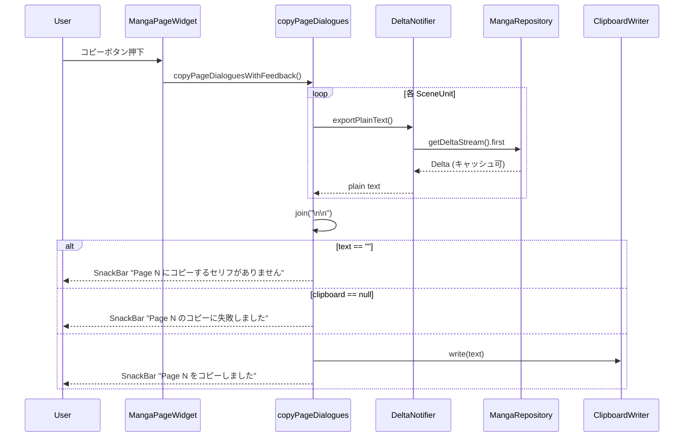
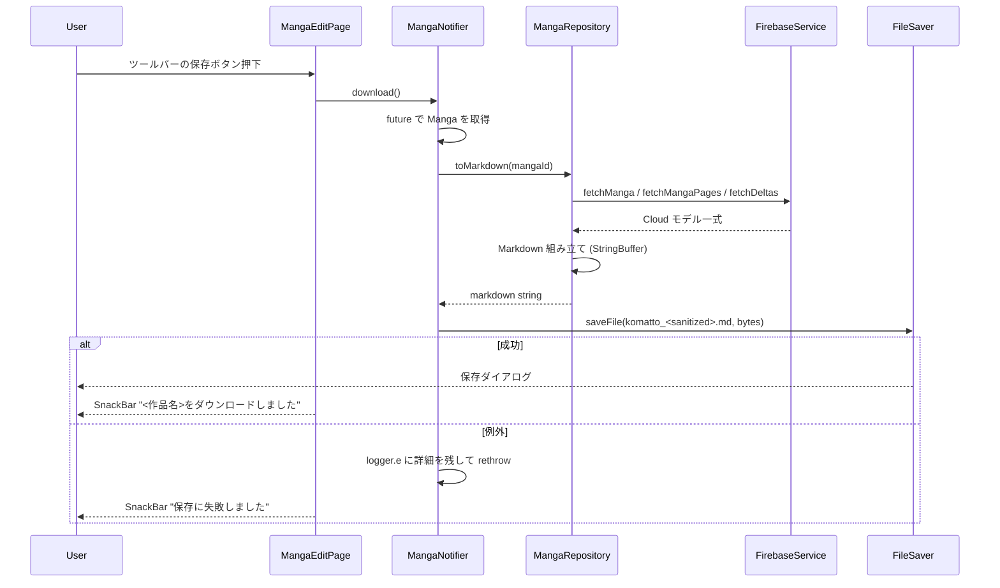

# Design: Manga Export

## メタデータ
- Status: implemented
- Last Updated: 2026-08-03

## 設計サマリ

Export 機能は 2 つの導線を持つ：

1. **ページ単位コピー** — UI (`manga_page_widget`) が `copy_page_dialogues.dart` の
   `copyPageDialoguesWithFeedback` を呼び、SceneUnit 順に `DeltaProvider.exportPlainText` を
   集めて `super_clipboard` へ書き込む。Repository を経由しない、UI 完結フロー。
2. **作品単位ファイル書き出し** — `MangaNotifier.download` が `MangaRepository.toMarkdown` を呼び、
   `file_saver` パッケージで保存ダイアログを開く。Repository 内部で Firestore から全 Delta を fetch。

両者とも **Delta → 文字列変換** が中核で、ここのロジック重複が当初の主な技術的負債だった。
現在は `my_manga_editor_common` の `deltaToPlainText` に集約済み（FR-005）。

## アーキテクチャ上の位置づけ

参照: [docs/design/architecture.md](../../../design/architecture.md)

| レイヤー | 担当 |
|---|---|
| UI (`lib/feature/manga/view/manga_page_widget.dart`) | コピーボタン |
| UI (`lib/feature/manga/view/copy_page_dialogues.dart`) | セリフの連結・クリップボード書き込み・結果の SnackBar 表示 |
| UI (`lib/feature/manga/page/manga_edit_page.dart`) | ツールバーの保存ボタンから `MangaNotifier.download` を起動し、失敗を SnackBar で通知 |
| State (`lib/feature/manga/provider/manga_providers.dart`) | `MangaNotifier.download` / `sanitizeFileName` / `isFileSaverFailure` / `DeltaNotifier.exportPlainText` |
| State (`lib/feature/manga/provider/clipboard_provider.dart`) | `SystemClipboard.instance` を provider 化（テストから差し替え可能にする） |
| Repository (`local_package/my_manga_editor_data/lib/repository/manga_repository.dart`) | `toMarkdown(MangaId)` で作品全体を文字列化 |
| Common (`local_package/my_manga_editor_common/lib/delta_text.dart`) | `deltaToPlainText`（FR-005 の集約先） |
| Service | 変更なし（既存の `fetchManga` / `fetchMangaPages` / `fetchDeltas` を使用） |
| Backend | 変更なし（読み取りのみ） |

## データモデル

参照: [docs/design/data-model.md](../../../design/data-model.md)

本機能で **新規追加するモデルは無い**。既存の以下のみを参照する：

- `Manga` (id, name, ideaMemoDeltaId)
- `MangaPage` (id, memoDeltaId, sceneUnits)
- `SceneUnit` (dialoguesDeltaId, stageDirectionDeltaId)
- `Delta` (flutter_quill の Delta フォーマット)

## 主要フロー

### Flow 1: ページ単位セリフコピー


```mermaid
sequenceDiagram
  participant U as User
  participant V as MangaPageWidget
  participant C as copyPageDialogues
  participant DN as DeltaNotifier
  participant R as MangaRepository
  participant CB as ClipboardWriter

  U->>V: コピーボタン押下
  V->>C: copyPageDialoguesWithFeedback()
  loop 各 SceneUnit
    C->>DN: exportPlainText()
    DN->>R: getDeltaStream().first
    R-->>DN: Delta (キャッシュ可)
    DN-->>C: plain text
  end
  C->>C: join("\n\n")
  alt text == ""
    C-->>U: SnackBar "Page N にコピーするセリフがありません"
  else clipboard == null
    C-->>U: SnackBar "Page N のコピーに失敗しました"
  else
    C->>CB: write(text)
    C-->>U: SnackBar "Page N をコピーしました"
  end
```

### Flow 2: 作品単位ファイル書き出し


```mermaid
sequenceDiagram
  participant U as User
  participant V as MangaEditPage
  participant MN as MangaNotifier
  participant R as MangaRepository
  participant FS as FirebaseService
  participant FSV as FileSaver

  U->>V: ツールバーの保存ボタン押下
  V->>MN: download()
  MN->>MN: future で Manga を取得
  MN->>R: toMarkdown(mangaId)
  R->>FS: fetchManga / fetchMangaPages / fetchDeltas
  FS-->>R: Cloud モデル一式
  R->>R: Markdown 組み立て (StringBuffer)
  R-->>MN: markdown string
  MN->>FSV: saveFile(komatto_<sanitized>.md, bytes)
  alt 成功
    FSV-->>U: 保存ダイアログ
    V-->>U: SnackBar "<作品名>をダウンロードしました"
  else 例外
    MN->>MN: logger.e に詳細を残して rethrow
    V-->>U: SnackBar "保存に失敗しました"
  end
```

## 主要 API / インターフェース

```dart
// MangaRepository
Future<String> toMarkdown(MangaId mangaId);

// MangaNotifier (lib/feature/manga/provider/manga_providers.dart)
// 失敗時は logger.e に残したうえで rethrow する (画面側で SnackBar を出すため)
// 戻り値は書き出した作品名。画面側が mangaProvider を読み直すと loading 中に
// 名前が取れないため、確定した名前をここから返す
Future<String> download();

// DeltaNotifier (lib/feature/manga/provider/manga_providers.dart)
Future<String> exportPlainText();

// lib/feature/manga/provider/manga_providers.dart (トップレベル関数)
// ファイル名に使えない文字と制御文字を _ に置換する
String sanitizeFileName(String name);
// file_saver は保存に失敗しても例外を投げず、空文字列や
// 'Something went wrong, ...' を返すことがある。それを失敗と判定する
bool isFileSaverFailure(String result);

// lib/feature/manga/provider/clipboard_provider.dart
// SystemClipboard.instance を provider 化したもの。使えない環境では null
@riverpod ClipboardWriter? clipboardWriter(Ref ref);

// lib/feature/manga/view/copy_page_dialogues.dart
// unavailable = クリップボードが無い環境
// failed = Delta の読み込み、または write が例外を投げた
// どちらも利用者には同じ「コピーに失敗しました」を出す
enum CopyPageDialoguesResult { copied, empty, unavailable, failed }
Future<String> buildPageDialoguesText(WidgetRef ref, MangaPage page);
Future<CopyPageDialoguesResult> copyPageDialogues(WidgetRef ref, MangaPage page);
Future<void> copyPageDialoguesWithFeedback(
    BuildContext context, WidgetRef ref, MangaPage page, int pageIndex);

// local_package/my_manga_editor_common/lib/delta_text.dart
//
// Quill の Delta からプレーンテキストを取り出す (FR-005 の集約先)。
// - op.data が String のものだけを連結
// - 2 行以上続く空行を空行 1 行に圧縮
// - 先頭・末尾の空行を落とす (行頭の字下げは残す)
String deltaToPlainText(Delta delta);
```

`deltaToPlainText` を `my_manga_editor_common` に置く理由は UI 層・データ層の両方から呼ぶため。
片側に寄せると依存方向の制約に反する。
なお common には `flutter_quill`（UI 一式）ではなく Delta 実装のみの `dart_quill_delta` を
依存に追加した（`flutter_quill/quill_delta.dart` はこのパッケージの再 export なので型は互換）。

## 出力フォーマット（Markdown）

見出しと本文の間、本文の後には必ず空行を 1 行入れる。

```markdown
# <作品名>

## アイデアメモ                  ← 本文が空なら出力しない

<アイデアメモ本文>

## ページ 1

### メモ                          ← 本文が空なら出力しない

<メモ本文>

### 本文                          ← ト書き・セリフが両方空なら出力しない

- （ト書き）<ト書きの 1 行目>
- （ト書き）<ト書きの 2 行目>
- <セリフの 1 行目>
- <セリフの 2 行目>

## ページ 2
...
```

ト書きとセリフは読む順序がそのまま意味を持つので、カットごとに見出しで分けず、
ページ全体で 1 つの箇条書きにまとめる（[manga_repository.dart の実装](../../../../local_package/my_manga_editor_data/lib/repository/manga_repository.dart)）。
本文の 1 行が 1 項目になり、空行は項目にしない。ト書きは行頭の `（ト書き）` で見分ける。
ページ内にト書きもセリフも無ければ `### 本文` ごと出力しない。

本文は `deltaToPlainText` を通すため、前後の空行と連続する空行は整形済みの状態になる。
そのうえで、`.md` として開いたときに書いたとおりに見えるよう Repository 側で次の 2 つを施す：

- 箇条書きにしない散文（アイデアメモ・メモ）は、本文が続く行の行末に半角スペース 2 つ
  （Markdown の強制改行）を付ける。付けないと 1 行ずつの改行が無視されて 1 段落に繋がる
- 行頭の記号 (`-` `+` `*` `>` `#` `=` `_` `~` バッククォート) と `1.` / `1)` は
  `\` でエスケープする。箇条書き・引用・見出し・罫線として解釈されるのを防ぐ
  （行の途中の記号は触らない。`（ト書き）` が付く行は行頭が記号にならないので対象外）

## 状態遷移 / ライフサイクル

本機能は副作用のある操作のみで、永続的な状態を持たない。
進行中インジケータ（ローディング UI）も現状なし。

## エラー / 例外設計

| ケース | 検出箇所 | 振る舞い |
|---|---|---|
| クリップボードが使えない (`clipboardWriterProvider` が null) | UI | `Page <N> のコピーに失敗しました` SnackBar（AC-1.4） |
| コピーするセリフが空 | UI | クリップボードを書き換えず `Page <N> にコピーするセリフがありません` SnackBar（AC-1.3） |
| `Manga` が Firestore に存在しない | Repository / Notifier | `NotFoundException` / `StateError` を throw → `manga_edit_page` で catch し `保存に失敗しました` SnackBar（AC-2.6） |
| Delta 取得・ファイル保存に失敗 | Repository / Notifier | `logger.e` に詳細を残して rethrow → UI で `保存に失敗しました` SnackBar |
| `file_saver` が例外を投げずに保存失敗を返す | Notifier | `isFileSaverFailure` で検出し `StateError` を throw（成功通知を出さない） |
| セリフの Delta 取得に失敗 | UI | `CopyPageDialoguesResult.failed` → `Page <N> のコピーに失敗しました` SnackBar（AC-1.4） |
| 作品が読み込み中 | UI | 保存ボタンを disabled にする（読み込み中の失敗通知を出さない） |
| ファイル保存ダイアログがキャンセル | `file_saver` | 例外なし。通知不要 |
| 作品名にファイル名禁止文字 | Notifier | `sanitizeFileName` が `/ \ : * ? " < > \|` + 制御文字を `_` に置換（AC-2.2） |

## テスト戦略

実装済みのテストは以下の通り。

- **ユニット (`MangaRepository.toMarkdown`)** —
  [manga_repository_export_test.dart](../../../../local_package/my_manga_editor_data/test/repository/manga_repository_export_test.dart):
  `FirebaseService` を mockito でモックし、SceneUnit 0 / 1 / 複数、空カット、
  ト書きとセリフの並び順とラベル、空 Delta 混在、アイデアメモあり / なし、
  本文の整形・メモの強制改行・エスケープを検証
- **ユニット (`deltaToPlainText`)** —
  [delta_text_test.dart](../../../../local_package/my_manga_editor_common/test/delta_text_test.dart):
  改行圧縮 / 装飾落ち / 空 Delta / 前後の空行落とし / 字下げの保持 / 埋め込みの無視 / 連結順序
- **ユニット (`DeltaNotifier.exportPlainText`)** —
  [delta_notifier_export_test.dart](../../../../test/feature/manga/provider/delta_notifier_export_test.dart)
- **ユニット (作品名サニタイズ)** —
  [manga_providers_test.dart](../../../../test/feature/manga/provider/manga_providers_test.dart):
  禁止文字 / 制御文字の置換、日本語・英数字がそのまま残ること
- **ウィジェット (コピー導線)** —
  [copy_page_dialogues_test.dart](../../../../test/feature/manga/view/copy_page_dialogues_test.dart):
  `clipboardWriterProvider` を差し替え、成功 / 空 / クリップボード無し / 書き込み例外 /
  Delta 読み込み失敗の SnackBar 出し分けと、クリップボードを書き換えないことを検証。
  `MangaPageWidget` 本体のボタン配線は重いので対象外（手動確認）
- **手動**:
  - 実機 / 実 ClipStudio Paint への貼り付けで縦書きが正しく流れるか（SC-001）
  - Web / macOS / Windows それぞれでファイル保存ダイアログが開くか

`MangaNotifier.download` 自体は `FileSaver.instance` (静的 singleton) を直接呼ぶため
自動テストの対象外。保存の成否に関わる分岐はサニタイズ関数と画面側の catch に寄せてある。

## 既存仕様への影響

本 spec は **既存実装の文書化** が出発点だったが、改善タスクで以下の挙動が変わった：

- ファイル拡張子変更 (`.txt` → `.md`)：保存されるファイル名が変わる
- 失敗時 / 空のときの SnackBar 追加：コピー・保存の結果表示が変わる
- Delta 変換ロジックの集約：作品全体の書き出しでも本文の trim と改行圧縮が効くようになった
- 出力 Markdown で見出しの後に必ず空行が入るようになった
- 出力 Markdown の本文に強制改行と行頭記号のエスケープが入るようになった
  (`.md` で開いたときに書いたとおりに見えるようにするため)
- ト書き・セリフをページ単位の 1 つの箇条書きにまとめ、カットの見出しを廃止した
  (`### カット N` / `#### ト書き` / `#### セリフ` → `### 本文` の箇条書き)

## 代替案 (Alternatives Considered)

- **案 A: 専用 `MangaExportService` を切り出す**
  - Repository から export 責務を分離。テスト容易・SRP に従う
  - 棄却理由: 現状 1 機能・1 メソッドで完結しており、サービス層を増やすほどの規模ではない
- **案 B: Delta → Markdown を `flutter_quill` 標準の Document.toPlainText() に統一**
  - 棄却理由: 改行圧縮や ト書き / セリフ階層の組み立てなど、本アプリ固有のルールが乗るため
    一段ラップする層は必要
- **案 C: Export 形式をユーザー選択（プレーン / Markdown / JSON）**
  - 棄却理由: スコープ外。要望が出てから検討
