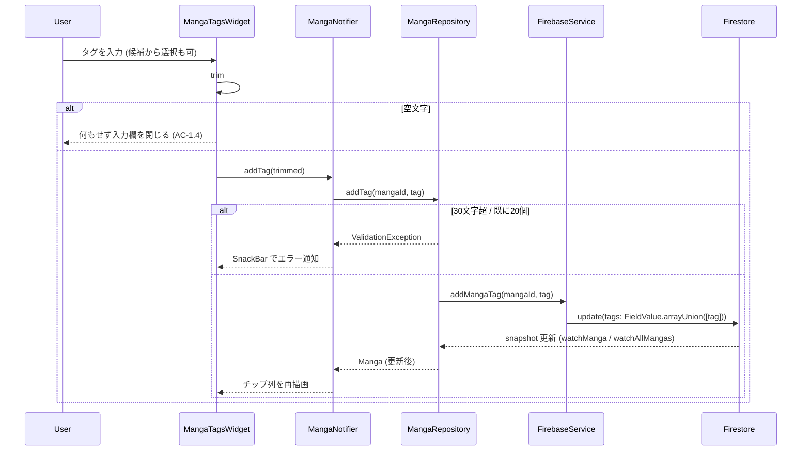
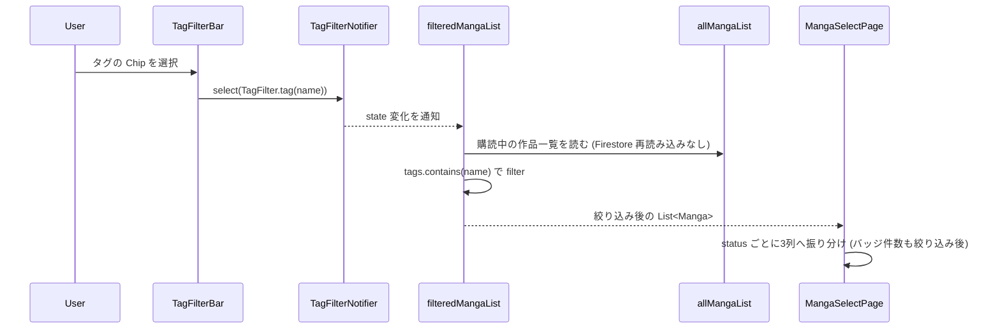
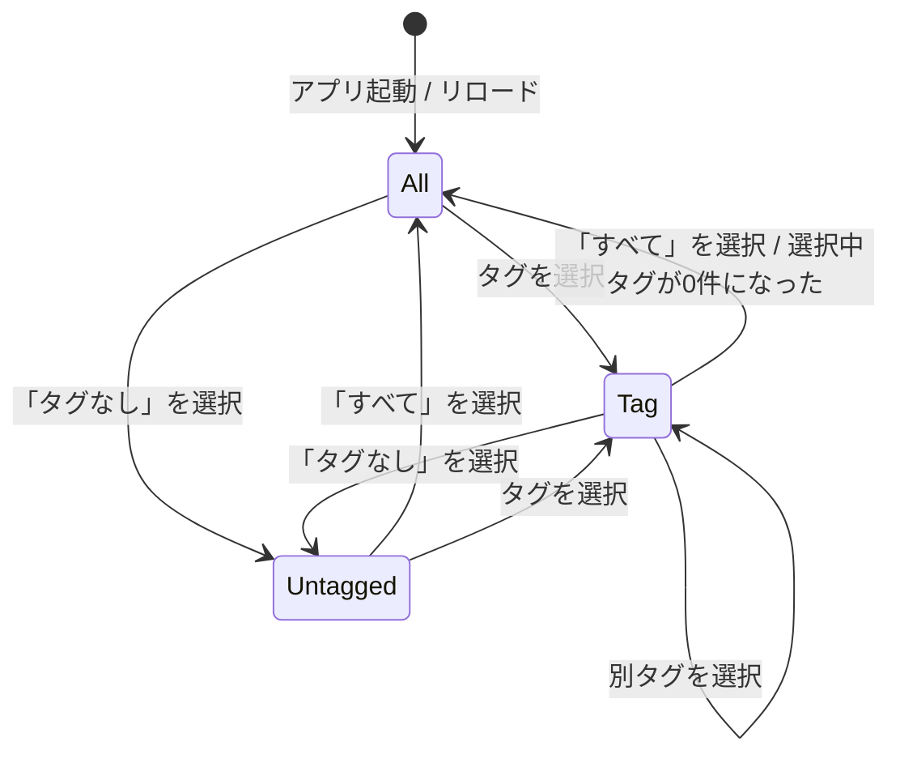

# Design: 作品タグ

## 設計サマリ

タグを**独立したエンティティにせず**、`Manga` が持つ文字列配列 `tags` として表現する。
「存在するタグの一覧」は作品一覧から `tags` を平坦化して重複除去するだけで、
タグ用のドキュメント・コレクション・ID は作らない。

シリーズは `連載:ヒーロー` のようなタグの付け方で表現し、システム側に専用の概念を持たせない。

変更は次の 3 点に閉じる。

1. **データ層** — `Manga` / `CloudManga` に `tags` を追加し、追加・削除を配列の差分操作で行う
2. **State 層** — 導出プロバイダ (`tagList`) と絞り込み状態 (`TagFilter`) を追加
3. **UI 層** — カンバン上部の絞り込みバー、カードのタグ表示、編集画面のタグ編集欄

Firestore への追加クエリは発生しない。絞り込みは既に購読済みの作品一覧をクライアント側で filter するだけ。
既存データのバックフィルも不要で、`tags` を持たないドキュメントは「タグ無し」として読める。

## アーキテクチャ上の位置づけ

参照: [docs/design/architecture.md](../../../design/architecture.md)

| レイヤー | この機能の追加・変更点 |
|---|---|
| UI (`lib/feature/manga/page/manga_select_page.dart`) | 絞り込みバーの設置。カンバンへ渡す作品リストを絞り込み後のものにする |
| UI (`lib/feature/manga/view/tag_filter_bar.dart`) | **新規**。`すべて` / `タグなし` / 各タグ の ChoiceChip 列（横スクロール） |
| UI (`lib/feature/manga/view/kanban_card.dart`) | カード下部にタグを最大 3 個 + `+N` で表示（AC-2.10） |
| UI (`lib/feature/manga/view/manga_tags_widget.dart`) | **新規**。編集画面のタグ編集欄（チップ + × / 追加入力 + 候補提示） |
| UI (`lib/feature/manga/page/manga_edit_page.dart`) | `MangaTitle` に `MangaTagsWidget` を差し込む |
| State (`lib/feature/manga/provider/tag_providers.dart`) | **新規**。`TagFilter` (freezed union) / `tagList` / `TagFilterNotifier` / `filteredMangaList` |
| State (`lib/feature/manga/provider/manga_providers.dart`) | `MangaNotifier.addTag` / `removeTag` を追加 |
| State (`lib/feature/manga/provider/manga_page_view_model.dart`) | `createNewManga` に初期タグを渡せるようにする |
| Repository (`manga_repository.dart`) | `addTag` / `removeTag` 追加、`createNewManga` に `tags` 引数追加、変換 extension の対応 |
| Service (`firebase_service.dart`) | **`addMangaTag` / `removeMangaTag` を追加**（下記「配列操作を Service に置く理由」参照） |
| Backend | Firestore の `mangas/{mangaId}` に `tags` 配列が増えるのみ。セキュリティルール変更なし |

## データモデル

参照: [docs/design/data-model.md](../../../design/data-model.md)

### ドメインモデル `Manga` への追加

| フィールド | 型 | 説明 |
|---|---|---|
| tags | `List<String>` (default `const []`) | 作品に付いたタグ。追加順。空リストは「タグ無し」 |

`List<String>?` ではなく **非 null + デフォルト空リスト** にする。
null と空リストの 2 通りの「タグ無し」を作らないため。

### クラウドモデル `CloudManga` への追加

| フィールド | 型 | 説明 |
|---|---|---|
| tags | `List<String>?` | タグ配列。フィールド欠損・null はいずれも「タグ無し」として読む |

- `fromFirestore`: `(data['tags'] as List<dynamic>?)?.cast<String>()`
  → ドメイン変換時に `?? const []`
- `toFirestore`: `'tags': tags ?? const <String>[]` を**常に**書く。
  タグ無しを空配列で表現する方針なので、キーの有無で状態を持たせない
- 追加・削除は配列全体の上書きではなく差分操作で行う（FR-006、下記）

### 制約

| 項目 | 値 | 検証箇所 |
|---|---|---|
| 1 タグの長さ | trim 後 1〜30 文字 | Repository (`ValidationException`) |
| 1 作品のタグ数 | 最大 20 個 | Repository (`ValidationException`) |
| 同一作品内の重複 | 不可（追加要求を黙って無視） | Repository（`arrayUnion` の性質でも保証される） |

### 配列操作を Service に置く理由 (FR-006)

タグの追加・削除で `tags` 配列を read-modify-write すると、
2 端末が別のタグを同時に足したとき後勝ちで片方が消える。
Firestore の `FieldValue.arrayUnion` / `arrayRemove` を使えばこれを避けられる。

`FieldValue` は `cloud_firestore` の型なので、
[architecture.md の「3rd party ライブラリは Service にラップして DI する」](../../../design/architecture.md)
に従い **`FirebaseService` に専用メソッドを置く**。
Repository は `Map` に `FieldValue` を詰めて `updateManga` に渡す形にはしない。

```dart
// FirebaseService（新規メソッド）
Future<void> addMangaTag(String mangaId, String tag);     // 内部で FieldValue.arrayUnion
Future<void> removeMangaTag(String mangaId, String tag);  // 内部で FieldValue.arrayRemove
```

`arrayUnion` は追加順を保ったまま末尾に足し、既存要素は無視する（FR-003 / FR-004 と一致）。

### schemaVersion を上げない判断

`CloudManga` の `schemaVersion` は **1 のまま据え置く**。

- 追加するのは省略可能なフィールド 1 本のみで、欠損時はデフォルト値（空配列 = タグ無し）として正しく読める
- 変換すべき旧形式が無いため `_migrateV1ToV2` に相当する処理が書けない（空の移行ステップになる）
- `CloudAppConfig` に `noticeMessage` / `noticeId` を足したときと同じ判断
  （[docs/design/data-model.md](../../../design/data-model.md) のスキーマバージョン履歴表を参照）

ただし「欠損しても読める」ことは回帰テストで固定する。
`test/data_migration/fixtures/manga/` に `tags` 無し／空配列／値ありの fixture を置き、
既存の `schema_version_fixture_test.dart` と同じ形式で `CloudManga` の読み込みを検証する
（`CloudManga` 用の fixture ディレクトリは本 spec で新設する）。

### 絞り込み状態 `TagFilter`（UI 層のみ・永続化しない）

```dart
// lib/feature/manga/provider/tag_providers.dart
@freezed
sealed class TagFilter with _$TagFilter {
  const factory TagFilter.all() = TagFilterAll;         // すべて
  const factory TagFilter.untagged() = TagFilterUntagged; // タグなし
  const factory TagFilter.tag(String name) = TagFilterTag;
}
```

Firestore には保存しない（AC-2.9）。`String?` に「null=すべて / 空文字=タグなし」を担わせる案もあるが、
2 種類の「無い」を 1 つの型に押し込むと分岐を読み違えるため union にする。
複数タグの同時選択（AND / OR）はスコープ外だが、
将来 `TagFilter.tags(List<String>)` を足す形で拡張できる。

## 主要フロー

### Flow 1: 作品にタグを付ける



`watchAllMangas` の snapshot が更新されると `tagList` も再計算されるため、
カンバンの絞り込み候補も同時に更新される（AC-1.9）。
削除も同じ経路で `removeMangaTag` → `arrayRemove` を通る。

### Flow 2: カンバンをタグで絞り込む



## 主要 API / インターフェース

```dart
// local_package/my_manga_editor_data/lib/model/manga.dart
@freezed
abstract class Manga with _$Manga {
  const factory Manga({
    required MangaId id,
    required String name,
    required MangaStartPage startPage,
    required DeltaId ideaMemoDeltaId,
    required MangaStatus status,
    @Default(<String>[]) List<String> tags,
  }) = _Manga;
}

// local_package/my_manga_editor_data/lib/service/firebase/firebase_service.dart
Future<void> addMangaTag(String mangaId, String tag);
Future<void> removeMangaTag(String mangaId, String tag);

// local_package/my_manga_editor_data/lib/repository/manga_repository.dart
Future<MangaId> createNewManga({String name = '無名の傑作', List<String> tags = const []});
/// tag は trim してから検証する。空文字は何もせず正常終了。
/// 30 文字超 / 既に 20 個で ValidationException
Future<void> addTag(MangaId id, String tag);
Future<void> removeTag(MangaId id, String tag);

// lib/feature/manga/provider/tag_providers.dart（新規）
/// 全作品の tags を平坦化し、重複除去して昇順に並べたもの
@riverpod
List<String> tagList(Ref ref);

@riverpod
class TagFilterNotifier extends _$TagFilterNotifier {
  @override
  TagFilter build();          // 初期値 TagFilter.all()
  void select(TagFilter filter);
}

/// allMangaList を現在の TagFilter で絞り込んだもの
@riverpod
List<Manga> filteredMangaList(Ref ref);

// lib/feature/manga/provider/manga_providers.dart（既存に追加）
// MangaNotifier
Future<void> addTag(String value);
Future<void> removeTag(String value);
```

### タグ数の上限チェックについて (AC-1.7)

`arrayUnion` は「現在何個あるか」を知らないため、上限は Repository が
購読済みの `Manga` を読んで判定する。厳密な排他ではなく、
2 端末の同時追加で 21 個目が入りうるが、上限は UI 保護のための目安なので許容する
（読み込み側は個数で失敗しない）。

### 絞り込みが宙に浮いたときの復帰 (AC-2.8)

`TagFilterNotifier.build()` の中で `tagList` を `ref.listen` し、
選択中の `TagFilterTag.name` が一覧から消えたら `TagFilter.all()` に戻す。
UI 側（`TagFilterBar`）に同じ判定を書かない — 状態の正しさは Notifier 1 箇所に置く。

## 状態遷移 / ライフサイクル



作品側のタグは状態機械を持たない（配列に入っているか否かだけ）。

## エラー / 例外設計

| ケース | 検出箇所 | 振る舞い |
|---|---|---|
| trim 後が空文字 | UI | 追加せず入力欄を閉じる。エラー表示なし（AC-1.4） |
| 既に同じタグが付いている | Repository | 何もせず正常終了（`arrayUnion` は冪等）。エラー表示なし（AC-1.5） |
| タグが 30 文字超 | Repository (`ValidationException`) | UI で catch し `タグは30文字以内で入力してください` の SnackBar（AC-1.6） |
| タグが既に 20 個 | Repository (`ValidationException`) | UI で catch し `タグは1作品につき20個までです` の SnackBar（AC-1.7） |
| 未認証で更新 | Repository (`AuthException`) | 既存の `updateMangaName` と同じ扱い（logger.e のみ。router の Auth Guard が先に効く） |
| Firestore 書き込み失敗 | Repository (`StorageException`) | `logger.e` に詳細を残し、UI は `タグの保存に失敗しました` の SnackBar（FR-008） |
| オフライン中の追加・削除 | — | Firestore のオフライン永続化に載る。エラー扱いしない（NFR-002） |
| `tags` フィールドが無い旧ドキュメント | `CloudManga.fromFirestore` | `null` → 変換時に `const []`（タグ無し）。エラーにしない（FR-007） |
| 選択中タグの作品が 0 件になった | `TagFilterNotifier` | `TagFilter.all()` に自動復帰（AC-2.8） |

## テスト戦略

- **ユニット (データ層 / `MangaRepository`)**
  - `addTag` が `FirebaseService.addMangaTag(id, tag)` を呼ぶ
    （mockito の `MockFirebaseService`、既存 `manga_repository_export_test.dart` と同じ方式）
  - `removeTag` が `removeMangaTag(id, tag)` を呼ぶ
  - 前後に空白のある入力が trim されて渡る / 空文字は Service を呼ばず正常終了
  - 31 文字で `ValidationException`、30 文字ちょうどは成功
  - 既にタグが 20 個ある作品への追加で `ValidationException`
  - `createNewManga(tags: ['X'])` が `tags` 入りの `CloudManga` を作る
- **ユニット (スキーマ後方互換 / `test/data_migration/`)**
  - `tags` 無し fixture → `Manga.tags == []`
  - `tags` 空配列 fixture → `[]`
  - `tags` 値あり fixture → 配列の順序どおり
  - `CloudManga.toFirestore` が `tags` キーを常に含む
- **ユニット (State 層 / `test/feature/manga/provider/`)**
  - `tagList` が平坦化・重複除去・昇順で返す（AC-2.2）
  - `filteredMangaList` が `all` / `untagged` / `tag` それぞれで正しく絞る（AC-2.3 / AC-2.4）
  - 複数タグを持つ作品がどのタグでも表示される（SC-003）
  - 選択中タグの作品が 0 件になったとき `all` に戻る（AC-2.8）
- **ウィジェット**
  - `TagFilterBar` の Chip を選ぶとカンバンの表示件数とバッジ件数が変わる（AC-2.3 / AC-2.5）
  - `KanbanCard` がタグ 4 個以上のとき 3 個 + `+1` を表示する（AC-2.10）
  - `MangaTagsWidget` の × でタグが 1 つだけ外れる（AC-1.3）
  - 入力途中で既存タグが候補に出る（AC-1.8）
  - 31 文字入力で SnackBar が出て追加されない（AC-1.6）
- **手動**
  - 絞り込み中にカードをドラッグしてステータスを変えてもタグが外れない（AC-2.7）
  - 絞り込み中の「新規作成」がそのタグ付きの作品を作る（AC-2.6）
  - 2 端末（またはブラウザ 2 タブ）で同じ作品に別々のタグを足すと両方残る（FR-006）

## 既存仕様への影響

- **既存データ**: バックフィル不要。`tags` 無しのドキュメントはタグ無しとして読める（NFR-004）
- **旧クライアント**: `tags` を知らない旧ビルドはフィールドを無視して従来どおり動作する。
  `minSupportedBuildNumber` の引き上げは不要（NFR-003）
- **既存 UI**: カンバンの3列構成・ドラッグ&ドロップは変えない。
  絞り込みバーの分だけカンバンの高さが縮み、カードはタグの行だけ縦に伸びる
- **書き出し**: Markdown 書き出しの内容にタグは含めない（スコープ外）
- **ドキュメント**: `docs/design/data-model.md` の Manga / CloudManga の表と、
  `.claude/rules/data-layer.md` の Firestore Schema 節に `tags` を追記する

## 代替案 (Alternatives Considered)

- **案 A: シリーズ専用の単一フィールド `Manga.seriesName` (String) を持つ**
  - 「1 作品 = 1 シリーズ」という実態に忠実で、UI も入力欄 1 つで済む
  - 棄却理由: 分類軸がシリーズ 1 本に固定される。
    `商業` `没ネタ` のような別軸で分けたくなった時点で 2 つ目のフィールドを足すことになり、
    絞り込み UI も軸ごとに増える。タグ 1 本ならシリーズは `連載:ヒーロー` という付け方で表現でき、
    仕組みが 1 つで済む
- **案 B: タグを独立エンティティにする (`users/{uid}/tags/{tagId}`, `Manga.tagIds`)**
  - タグのリネームが 1 箇所で済み、色・説明などの属性も持てる
  - 棄却理由: 今回必要なのは「名前でまとめて絞り込む」ことだけで、
    ドキュメント追加・参照整合（タグ削除時の孤児参照）・セキュリティルール追加のコストが見合わない。
    リネームや属性が必要になった時点で移行できる（既存の `tags` から `tags` ドキュメントを生成すればよい）
- **案 C: 絞り込みを Firestore クエリ (`where('tags', arrayContains: ...)`) で行う**
  - 棄却理由: 作品一覧は既に全件購読しており、クライアント側 filter で足りる（NFR-001）。
    クエリを足すと複合インデックスの管理と読み取り回数が増える
- **案 D: タグの追加・削除を配列全体の上書き (`update({'tags': [...]})`) で行う**
  - 実装は単純で Service の新規メソッドも不要
  - 棄却理由: 2 端末が別のタグを同時に足すと後勝ちで片方が消える。
    `arrayUnion` / `arrayRemove` なら避けられる問題をわざわざ持ち込む必要がない（FR-006）
- **案 E: 絞り込み状態を `shared_preferences` に永続化する**
  - 棄却理由: 起動時に「前回の絞り込みのせいで作品が見えない」事故を起こしやすい。
    まず `すべて` から始める挙動で運用し、要望が出てから検討する
