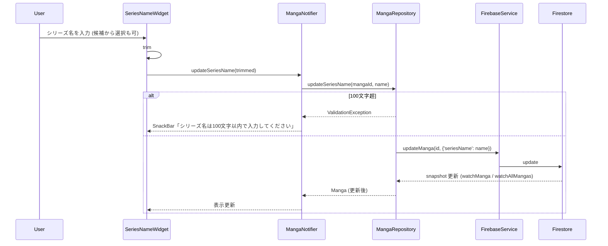
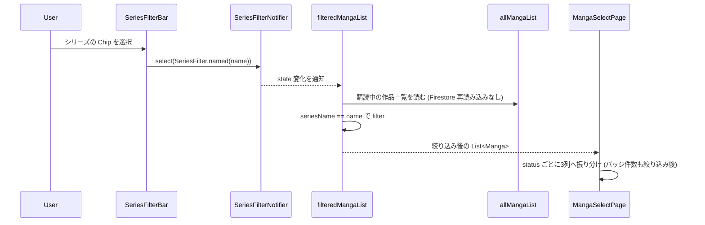
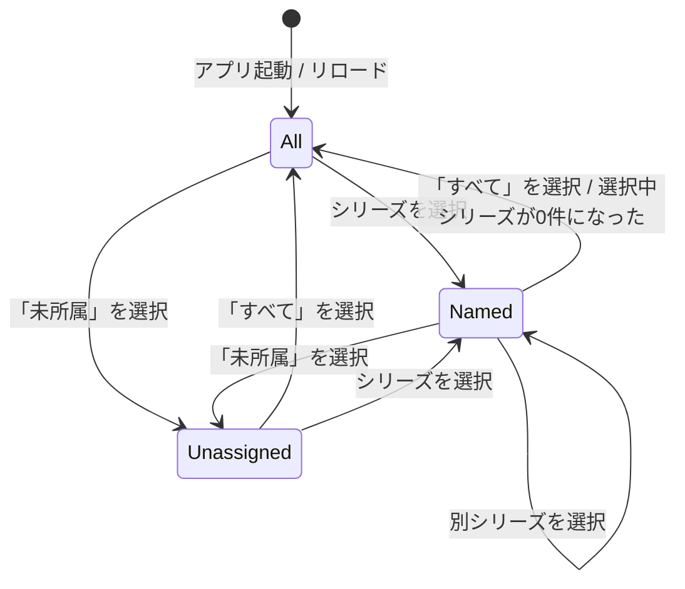

# Design: シリーズ管理

## 設計サマリ

シリーズを**独立したエンティティにせず**、`Manga` が持つ 1 本の文字列フィールド `seriesName` として表現する。
「シリーズの一覧」は作品一覧から `seriesName` を重複除去して導出するだけで、
シリーズ用のドキュメント・コレクション・ID は作らない。

そのため変更は次の 3 点に閉じる。

1. **データ層** — `Manga` / `CloudManga` に `seriesName` を追加し、`MangaRepository.updateSeriesName` を生やす
2. **State 層** — 導出プロバイダ (`seriesNameList`) と絞り込み状態 (`SeriesFilter`) を追加
3. **UI 層** — カンバン上部の絞り込みバーと、編集画面のシリーズ名入力欄

Firestore への追加クエリは発生しない。絞り込みは既に購読済みの作品一覧をクライアント側で filter するだけ。
既存データのバックフィルも不要で、`seriesName` を持たないドキュメントは「未所属」として読める。

## アーキテクチャ上の位置づけ

参照: [docs/design/architecture.md](../../../design/architecture.md)

| レイヤー | この機能の追加・変更点 |
|---|---|
| UI (`lib/feature/manga/page/manga_select_page.dart`) | 絞り込みバーの設置。カンバンへ渡す作品リストを絞り込み後のものにする |
| UI (`lib/feature/manga/view/series_filter_bar.dart`) | **新規**。`すべて` / `未所属` / 各シリーズ名 の ChoiceChip 列（横スクロール） |
| UI (`lib/feature/manga/view/series_name_widget.dart`) | **新規**。編集画面のシリーズ名入力欄（既存名の候補提示つき） |
| UI (`lib/feature/manga/page/manga_edit_page.dart`) | `MangaTitle` に `SeriesNameWidget` を差し込む |
| State (`lib/feature/manga/provider/series_providers.dart`) | **新規**。`SeriesFilter` (freezed union) / `seriesNameList` / `SeriesFilterNotifier` / `filteredMangaList` |
| State (`lib/feature/manga/provider/manga_providers.dart`) | `MangaNotifier.updateSeriesName` を追加 |
| State (`lib/feature/manga/provider/manga_page_view_model.dart`) | `createNewManga` にシリーズ名を渡せるようにする |
| Repository (`manga_repository.dart`) | `updateSeriesName` 追加、`createNewManga` に `seriesName` 引数追加、変換 extension の対応 |
| Service | **変更なし**（既存の `updateManga` / `createManga` をそのまま使う） |
| Backend | Firestore の `mangas/{mangaId}` に `seriesName` フィールドが増えるのみ。セキュリティルール変更なし |

## データモデル

参照: [docs/design/data-model.md](../../../design/data-model.md)

### ドメインモデル `Manga` への追加

| フィールド | 型 | 説明 |
|---|---|---|
| seriesName | `String` (default `''`) | シリーズ名。空文字は「未所属」 |

`String?` ではなく **`String` + デフォルト空文字** にする。
null と空文字の 2 通りの「未所属」を作らないため（FR-003）。

### クラウドモデル `CloudManga` への追加

| フィールド | 型 | 説明 |
|---|---|---|
| seriesName | `String?` | シリーズ名。フィールド欠損・null はいずれも「未所属」として読む |

- `fromFirestore`: `seriesName: data['seriesName'] as String?` → ドメイン変換時に `?? ''`
- `toFirestore`: `'seriesName': seriesName ?? ''` を**常に**書く。
  未所属を空文字で表現する方針なので、キーの有無で状態を持たせない
- 未所属に戻す更新も `updateManga(id, {'seriesName': ''})` で行い、
  `FieldValue.delete()` は使わない（[.claude/rules/data-layer.md](../../../../.claude/rules/data-layer.md) の expand-contract）

### schemaVersion を上げない判断

`CloudManga` の `schemaVersion` は **1 のまま据え置く**。

- 追加するのは省略可能なフィールド 1 本のみで、欠損時はデフォルト値（空文字 = 未所属）として正しく読める
- 変換すべき旧形式が無いため `_migrateV1ToV2` に相当する処理が書けない（空の移行ステップになる）
- `CloudAppConfig` に `noticeMessage` / `noticeId` を足したときと同じ判断
  （[docs/design/data-model.md](../../../design/data-model.md) のスキーマバージョン履歴表を参照）

ただし「欠損しても読める」ことは回帰テストで固定する。
`test/data_migration/fixtures/manga/` に `seriesName` 無し／空文字／値ありの fixture を置き、
既存の `schema_version_fixture_test.dart` と同じ形式で `CloudManga` の読み込みを検証する
（`CloudManga` 用の fixture ディレクトリは本 spec で新設する）。

### 絞り込み状態 `SeriesFilter`（UI 層のみ・永続化しない）

```dart
// lib/feature/manga/provider/series_providers.dart
@freezed
sealed class SeriesFilter with _$SeriesFilter {
  const factory SeriesFilter.all() = SeriesFilterAll;               // すべて
  const factory SeriesFilter.unassigned() = SeriesFilterUnassigned; // 未所属
  const factory SeriesFilter.named(String name) = SeriesFilterNamed;
}
```

Firestore には保存しない（AC-2.9）。`String?` に「null=すべて / 空文字=未所属」を担わせる案もあるが、
2 種類の「無い」を 1 つの型に押し込むと分岐を読み違えるため union にする。

## 主要フロー

### Flow 1: 作品にシリーズ名を付ける



`watchAllMangas` の snapshot が更新されると `seriesNameList` も再計算されるため、
カンバンの絞り込み候補も同時に更新される（AC-1.7）。

### Flow 2: カンバンをシリーズで絞り込む



## 主要 API / インターフェース

```dart
// local_package/my_manga_editor_data/lib/model/manga.dart
@freezed
abstract class Manga with _$Manga {
  const factory Manga({
    required MangaId id,
    required String name,
    required MangaStartPage startPage,
    required DeltaId ideaMemoDeltaId,
    required MangaStatus status,
    @Default('') String seriesName,
  }) = _Manga;
}

// local_package/my_manga_editor_data/lib/repository/manga_repository.dart
Future<MangaId> createNewManga({String name = '無名の傑作', String seriesName = ''});
/// name は trim 済みを想定。空文字は「未所属」。100 文字超は ValidationException
Future<void> updateSeriesName(MangaId id, String seriesName);

// lib/feature/manga/provider/series_providers.dart（新規）
/// 全作品の seriesName から空文字を除き、重複除去して昇順に並べたもの
@riverpod
List<String> seriesNameList(Ref ref);

@riverpod
class SeriesFilterNotifier extends _$SeriesFilterNotifier {
  @override
  SeriesFilter build();          // 初期値 SeriesFilter.all()
  void select(SeriesFilter filter);
}

/// allMangaList を現在の SeriesFilter で絞り込んだもの
@riverpod
List<Manga> filteredMangaList(Ref ref);

// lib/feature/manga/provider/manga_providers.dart（既存に追加）
// MangaNotifier
Future<void> updateSeriesName(String value);
```

### 絞り込みが宙に浮いたときの復帰 (AC-2.8)

`SeriesFilterNotifier.build()` の中で `seriesNameList` を `ref.listen` し、
選択中の `SeriesFilterNamed.name` が一覧から消えたら `SeriesFilter.all()` に戻す。
UI 側（`SeriesFilterBar`）に同じ判定を書かない — 状態の正しさは Notifier 1 箇所に置く。

## 状態遷移 / ライフサイクル



作品側のシリーズ所属は状態機械を持たない（`seriesName` が空文字か否かだけ）。

## エラー / 例外設計

| ケース | 検出箇所 | 振る舞い |
|---|---|---|
| シリーズ名が 100 文字超 | Repository (`ValidationException`) | UI で catch し `シリーズ名は100文字以内で入力してください` の SnackBar。変更前の値を保持（AC-1.6） |
| 未認証で更新 | Repository (`AuthException`) | 既存の `updateMangaName` と同じ扱い（logger.e のみ。router の Auth Guard が先に効く） |
| Firestore 書き込み失敗 | Repository (`StorageException`) | `logger.e` に詳細を残し、UI は `シリーズ名の保存に失敗しました` の SnackBar（FR-006） |
| オフライン中の更新 | — | Firestore のオフライン永続化に載る。エラー扱いしない（NFR-002） |
| `seriesName` フィールドが無い旧ドキュメント | `CloudManga.fromFirestore` | `null` → 変換時に `''`（未所属）。エラーにしない（FR-005） |
| 選択中シリーズの作品が 0 件になった | `SeriesFilterNotifier` | `SeriesFilter.all()` に自動復帰（AC-2.8） |

## テスト戦略

- **ユニット (データ層 / `MangaRepository`)**
  - `updateSeriesName` が `updateManga(id, {'seriesName': ...})` を呼ぶ（mockito の `MockFirebaseService`、既存 `manga_repository_export_test.dart` と同じ方式）
  - 100 文字超で `ValidationException`、100 文字ちょうどは成功
  - 空文字を渡すと空文字で更新される（フィールド削除ではない）
  - `createNewManga(seriesName: 'X')` が `seriesName` 入りで作られる
- **ユニット (スキーマ後方互換 / `test/data_migration/`)**
  - `seriesName` 無し fixture → `Manga.seriesName == ''`
  - `seriesName` 空文字 fixture → `''`
  - `seriesName` 値あり fixture → その値
  - `CloudManga.toFirestore` が `seriesName` キーを常に含む
- **ユニット (State 層 / `test/feature/manga/provider/`)**
  - `seriesNameList` が重複除去・空文字除外・昇順で返す（AC-2.2）
  - `filteredMangaList` が `all` / `unassigned` / `named` それぞれで正しく絞る（AC-2.3 / AC-2.4）
  - 選択中シリーズが一覧から消えたとき `all` に戻る（AC-2.8）
- **ウィジェット**
  - `SeriesFilterBar` の Chip を選ぶとカンバンの表示件数とバッジが変わる（AC-2.3 / AC-2.5）
  - `SeriesNameWidget` が未所属時にプレースホルダを出す（AC-1.3）
  - 入力途中で既存シリーズ名が候補に出る（AC-1.5）
- **手動**
  - 絞り込み中にカードをドラッグしてステータスを変えてもシリーズが外れない（AC-2.7）
  - 絞り込み中の「新規作成」がそのシリーズの作品を作る（AC-2.6）
  - 2 端末（またはブラウザ 2 タブ）で片方のシリーズ名を変えると、もう片方の候補に反映される（AC-1.7）

## 既存仕様への影響

- **既存データ**: バックフィル不要。`seriesName` 無しのドキュメントは未所属として読める（NFR-004）
- **旧クライアント**: `seriesName` を知らない旧ビルドはフィールドを無視して従来どおり動作する。
  `minSupportedBuildNumber` の引き上げは不要（NFR-003）
- **既存 UI**: カンバンの3列構成・ドラッグ&ドロップ・カードの中身は変えない。
  絞り込みバーの分だけカンバンの高さが縮む
- **書き出し**: Markdown 書き出しの内容にシリーズ名は含めない（スコープ外）
- **ドキュメント**: `docs/design/data-model.md` の Manga / CloudManga の表と、
  `.claude/rules/data-layer.md` の Firestore Schema 節に `seriesName` を追記する

## 代替案 (Alternatives Considered)

- **案 A: シリーズを独立エンティティにする (`users/{uid}/series/{seriesId}`, `Manga.seriesId`)**
  - シリーズ名のリネームが 1 箇所で済み、シリーズ共通メモや話数順の置き場所も自然にできる
  - 棄却理由: 今回必要なのは「名前でまとめて絞り込む」ことだけで、
    ドキュメント追加・参照整合（シリーズ削除時の孤児作品）・セキュリティルール追加のコストが見合わない。
    共通メモや話数順が必要になった時点で案 A へ移行する（`seriesName` → `series` ドキュメント生成は移行可能）
- **案 B: `Manga` に `List<String> tags` を持たせ、シリーズをタグの一種として扱う**
  - 棄却理由: 1 作品 = 1 シリーズという実態に対して表現力が過剰。
    「どのタグがシリーズか」の規約が別途必要になる
- **案 C: 絞り込みを Firestore クエリ (`where('seriesName', isEqualTo: ...)`) で行う**
  - 棄却理由: 作品一覧は既に全件購読しており、クライアント側 filter で足りる（NFR-001）。
    クエリを足すと複合インデックスの管理と読み取り回数が増える
- **案 D: 絞り込み状態を `shared_preferences` に永続化する**
  - 棄却理由: 起動時に「前回の絞り込みのせいで作品が見えない」事故を起こしやすい。
    まず `すべて` から始める挙動で運用し、要望が出てから検討する
